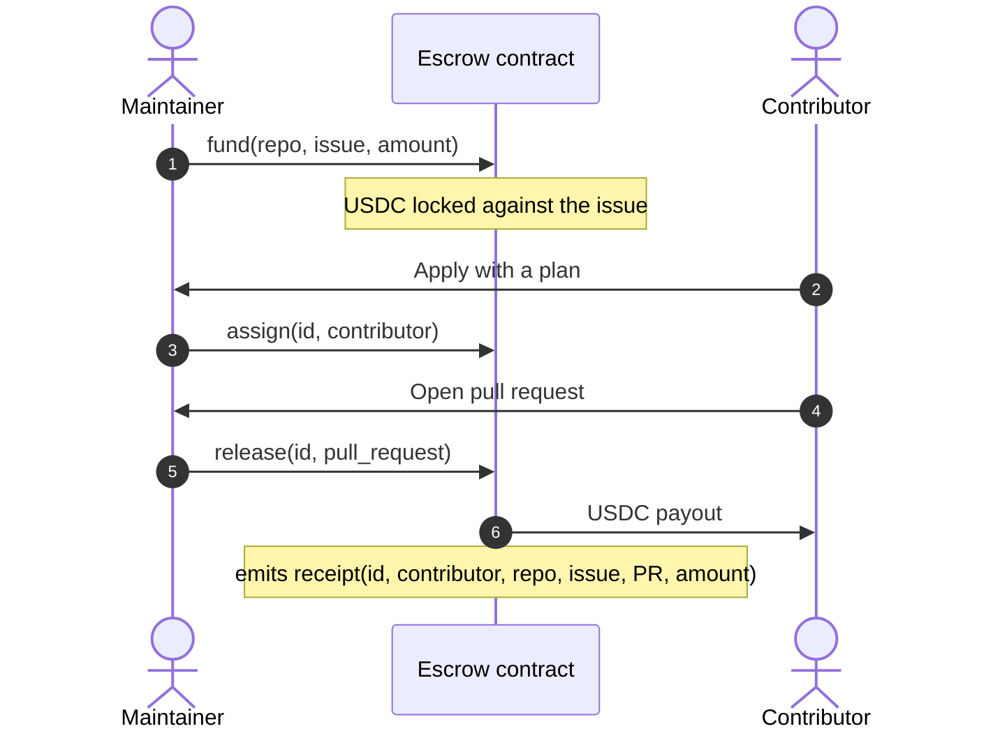
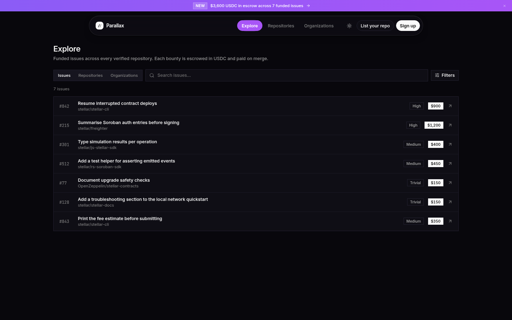
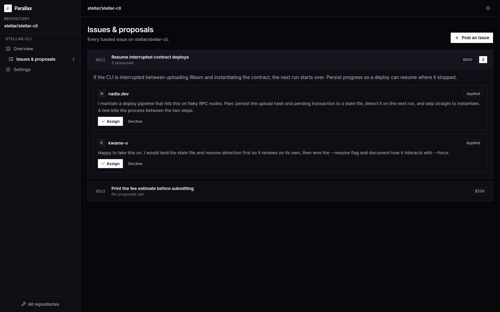

<div align="center">


# Escaro

**Per-issue bounties for open-source work, escrowed and settled on Stellar.**

[](https://github.com/Escaro-Labs/escaro/actions/workflows/ci.yml)
[](LICENSE)
[](https://stellar.org)
[](contracts/)
[](https://github.com/Escaro-Labs/escaro/issues?q=is%3Aissue+is%3Aopen+label%3A%22complexity%3A+trivial%22)

[How it works](#how-it-works) · [Quick start](#quick-start) · [Architecture](docs/architecture.md) · [Contract](contracts/README.md) · [Roadmap](#roadmap) · [Contributing](CONTRIBUTING.md)

</div>

<br />


## Table of Contents

- [How it uses Stellar](#how-it-uses-stellar)
- [What it is](#what-it-is)
- [Why per-issue escrow](#why-per-issue-escrow)
- [How it works](#how-it-works)
- [Features](#features)
- [Prerequisites](#prerequisites)
- [Quick start](#quick-start)
- [Project structure](#project-structure)
- [Testing](#testing)
- [Roadmap](#roadmap)
- [Security](#security)
- [Contributing](#contributing)
- [Data boundaries](#data-boundaries)

## How it uses Stellar

Escaro keeps bounties in **Soroban** escrow on **Stellar** and settles them in USDC on the Stellar network. Payouts are ordinary Stellar transactions, so every escrow, release, and refund is publicly auditable; wallet signing is delegated to Freighter and secret keys never touch the app.

## What it is

Escaro lets a maintainer put a fixed **USDC** bounty on a single GitHub issue. The money is
locked in a **Soroban escrow contract** when the issue is posted and released to the contributor
the moment their pull request merges. Every payout emits a public **receipt**, so a contributor's
record of shipped work travels with them from project to project.

Two views of the same work: maintainers see a backlog that gets done; contributors see money that
is already there.

> [!NOTE]
> **Status: testnet preview.** The escrow contract is deployed to Stellar testnet. The web app
> still runs the full product flow on local browser data and does not call the contract yet, so no
> real funds move. See the [roadmap](#roadmap).

## Why per-issue escrow

| | Funding rounds | Escaro |
| --- | --- | --- |
| Unit of funding | A pool for a time window | One issue |
| Price | Points converted to a share of the pool later | Fixed bounty, known before you apply |
| When money is committed | When the round is funded | When the issue is posted, in escrow |
| When you are paid | When the round closes | When your pull request merges |
| Record of work | Platform history | A public, on-chain receipt per payout |

Escaro is a complement to grant programs, not a replacement. A project in a funding round can
still put money on an urgent issue the day it needs doing.

## How it works



1. **Connect.** A maintainer connects a repository and verifies they maintain it. No dashboard
   opens until that passes.
2. **Fund.** The maintainer posts an issue with acceptance criteria and a bounty. The bounty is
   locked in escrow.
3. **Apply.** Contributors send a short plan. The maintainer assigns one; the others are declined
   automatically.
4. **Build.** The assignee opens a pull request.
5. **Merge and release.** Merging releases the bounty to the contributor's Stellar address and
   writes their receipt. Unpaid bounties can be refunded to the maintainer.

## Features

**For contributors**
- Browse funded issues across every connected repository, with search, filters and sorting by bounty
- See the escrowed amount and acceptance criteria before applying
- Track assignments, submit a pull request, and collect a receipt for every payout
- Set a Stellar payout address (validated as a real account id)

**For maintainers**
- A separate maintainer area, with a dashboard per verified repository
- Post an issue and fund it in one step; complexity suggests a starting price
- Pick one contributor per issue; the rest are declined automatically
- Merge and release in one action; see escrowed and paid-out totals at a glance

**Escrow contract**
- `fund`, `assign`, `release`, `refund` — one open bounty per issue
- Only the maintainer who funded a bounty can move it
- `receipt` events indexed by contributor address for a portable work history

<table>
  <tr>
    <td></td>
    <td></td>
  </tr>
  <tr>
    <td align="center"><sub>Explore funded issues</sub></td>
    <td align="center"><sub>Maintainer triage and release</sub></td>
  </tr>
</table>

## Prerequisites

| Tool | Notes |
| --- | --- |
| **Node.js** | 22+ (see `.nvmrc`) |
| **npm** | bundled with Node |
| **Rust + Stellar CLI** | only to build/ deploy the Soroban contracts |

## Quick start

**Web app** — Node.js 22+

```bash
git clone https://github.com/Escaro-Labs/escaro.git
cd escaro
npm install
npm run dev            # http://localhost:3000
```

**Contract** — Rust with the `wasm32v1-none` target, and the
[Stellar CLI](https://developers.stellar.org/docs/tools/cli) 25.2+ to build the wasm

```bash
cd contracts
cargo test
stellar contract build
```

**Try the full flow locally**

1. Sign in at `/maintainer/login` with any handle and connect a repository, e.g. `you/demo`.
2. Click **Simulate verification**, open the dashboard, and **Post an issue**.
3. In another tab, sign in as a contributor at `/login` and apply to that issue.
4. Back as the maintainer, **Assign** the proposal. As the contributor, **Submit PR**.
5. As the maintainer, **Merge & release**. The receipt appears at `/me/receipts`.

Settings → **Reset preview data** restores the sample data at any time.

## Project structure

```
escaro/
├── src/
│   ├── lib/
│   │   ├── platform.ts      # product name, chain, network, asset — all copy reads from here
│   │   ├── model.ts         # types, pure helpers, the dashboard gate, seed data
│   │   └── store.tsx        # app state in one React context, persisted to localStorage
│   ├── pages/               # one file per surface: landing, explore, issue, contributor, maintainer
│   ├── components/          # shared UI primitives and React Bits motion/WebGL effects
│   └── App.tsx              # routes, public shell, workspace shells and route guards
├── contracts/
│   └── escrow/              # Soroban escrow contract and its tests
├── scripts/
│   └── smoke-test.mjs       # end-to-end test of every flow at five viewport widths
└── docs/                    # architecture notes and screenshots
```

Read [docs/architecture.md](docs/architecture.md) for how state, routing, the maintainer gate and
the contract fit together.

## Testing

| Command | What it checks |
| --- | --- |
| `npm run build` | TypeScript typecheck and production build |
| `npm run test:smoke -- http://localhost:3000` | End-to-end: every flow, 15 routes at 5 widths, no horizontal overflow |
| `cargo test` (in `contracts/`) | Contract unit tests: payouts, refunds, double-pay, auth |
| `cargo clippy --all-targets -- -D warnings` | Contract lints |

CI runs all of these, plus the wasm build, on every pull request.

## Roadmap

- [x] Product flow in the browser: connect, fund, apply, assign, merge and release, receipts
- [x] Soroban escrow contract with tests
- [x] Deploy the contract to testnet — [#3](https://github.com/Escaro-Labs/escaro/issues/3)
- [ ] Connect Freighter for maintainers — [#2](https://github.com/Escaro-Labs/escaro/issues/2)
- [ ] Fund bounties on-chain from the dashboard — [#4](https://github.com/Escaro-Labs/escaro/issues/4)
- [ ] Read receipts from contract events — [#5](https://github.com/Escaro-Labs/escaro/issues/5)
- [ ] Top up an open bounty — [#6](https://github.com/Escaro-Labs/escaro/issues/6)
- [ ] Passkey smart wallets so contributors can get paid without a seed phrase
- [ ] GitHub app: real sign-in, ownership verification, release triggered by the merge

## Security

- **Never commit secrets** — keep keys, seed phrases, and `.env` files out of source control.
- **Testnet values have no real-world value**; treat testnet deployments as experimental.
- **Keys never leave the wallet** — signing is delegated to the user's Stellar wallet; the app does not store secret keys.
- Report vulnerabilities per `SECURITY.md` where present rather than opening a public issue.

## Contributing

Contributions are welcome — Escaro is built to be worked on in small, well-scoped pieces. Pick
an [open issue](https://github.com/Escaro-Labs/escaro/issues), comment with a short plan, and
wait to be assigned. Issues labelled `complexity: trivial` are a good place to start.

Read [CONTRIBUTING.md](CONTRIBUTING.md) for setup, checks and pull request guidelines, and the
[Code of Conduct](CODE_OF_CONDUCT.md) before taking part. Report security issues privately as
described in [SECURITY.md](SECURITY.md).

## Data boundaries

The seeded repositories are **real, existing open-source projects** used as reference examples so
the directory renders with genuine avatars. Their star counts, topics, issues and bounties are
fixtures, and their presence here implies no affiliation with, or participation in, Escaro.
Sample contributors (`nadia.dev`, `kwame-o`, `lucia-m`, `tobi.k`) are fictional.

## License

[MIT](LICENSE)
