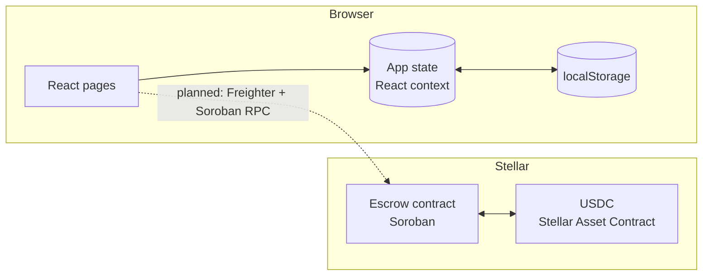
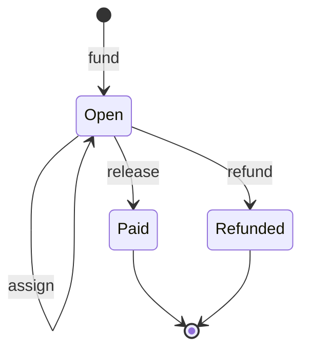

# Architecture

How the pieces of Parallax fit together. Read this before a change that touches state, routing or
the contract.

## Overview



Today the web app is self-contained: all state lives in the browser. The escrow contract is
complete and tested on its own. Connecting the two is tracked in issues #2–#5.

## Web app

### Stack

React 19, TypeScript, Vite 7, React Router 7, `motion` for animation, `lucide-react` for icons.
No CSS framework — styles are plain CSS on design tokens in `src/styles/base.css`.

### State

`src/lib/store.tsx` holds one `State` object (defined in `src/lib/model.ts`) in a React context
and writes it to `localStorage` on every change, under `storageKey`.

```ts
interface State {
  version: 1;
  session: { contributor: string | null; maintainer: string | null };
  payoutAddress: string | null;
  repos: Repo[];
  issues: Issue[];
  applications: Application[];
  receipts: Receipt[];
}
```

- **Shape changes.** If you change `State`, bump `version` and `storageKey` together. `readState`
  discards anything that does not match, so old browser data is reset instead of misread.
- **Persistence is best-effort.** The write effect in `src/lib/store.tsx` is wrapped in a `try`/`catch` whose `catch` is intentionally empty: private mode, a full `localStorage` quota, or a blocked storage partition silently stops persistence for the session. The in-memory `State` keeps running, but on reload `readState` finds nothing under `storageKey` and starts a fresh preview — so a maintainer who hit quota and refreshed will see seeded sample data, not their work. The note in `readState` says as much ("Unreadable storage starts a fresh preview"). Link the fix when one ships.
- **Derived values** (escrowed totals, whether an issue is paid, status tones) are pure helpers in
  `model.ts`. Keep logic there rather than in components so it can be tested and reused.
- **The signed-in contributor's own application** has no `applicant` field. Seeded sample
  contributors have one. `isOwnApplication` and `applicantName` encode this.

### Sessions

Contributor and maintainer are separate fields in `session`. Signing into one never grants the
other. Both are local display names in the preview; GitHub sign-in replaces them later.

### Routing and the maintainer gate

Routes are declared in `src/App.tsx`. Public pages render inside `PublicShell` (top nav);
workspaces render inside `WorkspaceShell` (left rail).

The gate is `canOpenRepoDashboard(repo, maintainer)` in `model.ts`: a repository dashboard opens
only when the repository exists, is `Verified`, and is owned by the signed-in maintainer.
`RepoShell` enforces it on the route, so a direct URL to an unverified or someone else's
repository redirects to `/maintainer`. Never enforce it only in the UI.

### Bounty lifecycle (web)

| Step | Who | State change |
| --- | --- | --- |
| Post issue | maintainer | new `Issue` with `bounty` |
| Apply | contributor | new `Application`, status `Applied` |
| Assign | maintainer | chosen → `Assigned`; other `Applied` → `Rejected` |
| Submit PR | contributor | `Assigned` → `PR submitted`, `pr` set |
| Merge & release | maintainer | → `Paid`; new `Receipt` |

An issue's bounty counts as escrowed until one of its applications is `Paid`.

### Copy and branding

Product name, chain, network and asset come from `src/lib/platform.ts`. Do not hard-code
"Parallax", "Stellar" or "USDC" in components.

### Motion and accessibility

Every animated component must render fully visible under `prefers-reduced-motion`. The WebGL hero
(`MoltenMetal`) stops drawing when off-screen or when the tab is hidden, and falls back to a CSS
gradient without WebGL.

## Escrow contract

Source: `contracts/escrow/src/lib.rs`. Full interface: [contracts/README.md](../contracts/README.md).

### Lifecycle



### Invariants

- Every state change after `fund` requires the auth of the maintainer who funded the bounty.
- An issue (`repo` + `issue` number) has at most one `Open` bounty. The index is cleared on
  release or refund, so the issue can be funded again.
- `Paid` and `Refunded` are terminal. Any call on a closed bounty fails with `NotOpen`.
- State is written before the outgoing token transfer, so a failed transfer reverts everything.
- Storage entries are extended to roughly a year on every write, so long-running bounties do not
  expire.

### Storage

| Key | Kind | Value |
| --- | --- | --- |
| `Token` | instance | payment token address, set in the constructor |
| `Counter` | instance | last bounty id |
| `Bounty(id)` | persistent | the `Bounty` record |
| `Issue(repo, issue)` | persistent | id of the open bounty on that issue |

## Testing

- `scripts/smoke-test.mjs` drives Chromium through every flow and checks 15 routes at five widths
  for horizontal overflow. It serves GitHub avatars locally, so it needs no network. When it waits
  for a view to change, wait on something unique to the new view (for example its result count),
  not on an element both views share.
- `contracts/escrow/src/test.rs` covers payouts, refunds, double-pay, duplicate funding, invalid
  amounts and auth. Snapshot files under `test_snapshots/` are generated by the SDK; commit them.
